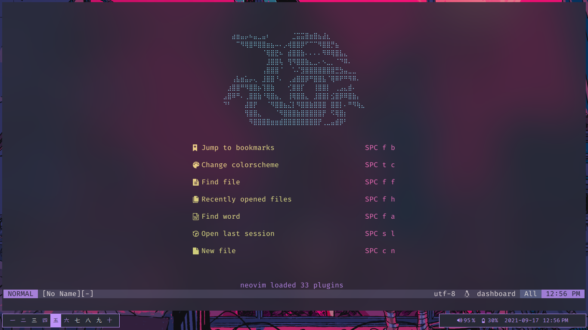
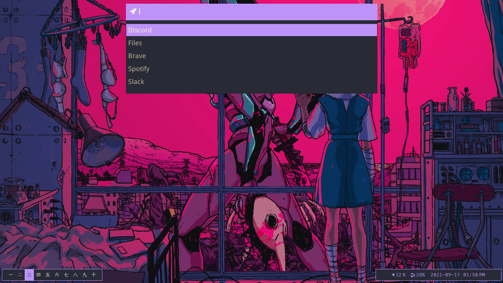
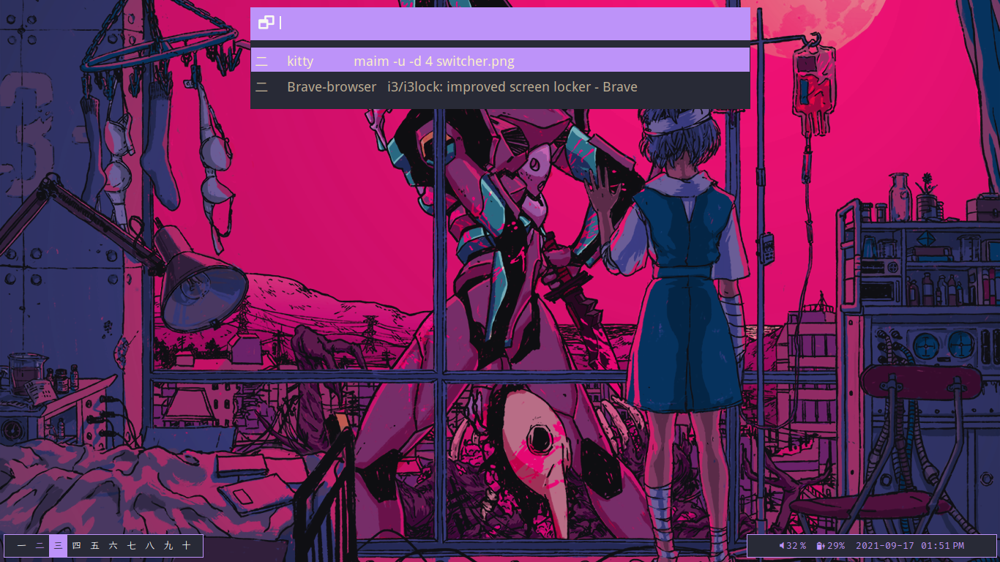
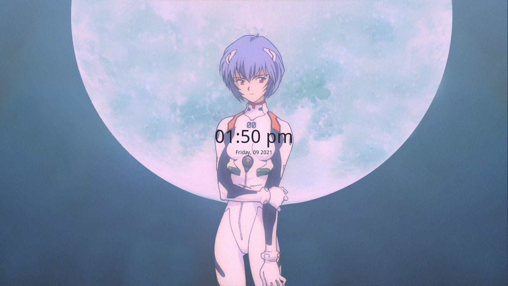

# Rei-II rice (completely unrelated name, i know, but the original repo was named rei so whatever)

## Previews

## Programs
* rofi
* polybar
* i3lock-color
* eww
* kitty
* maim
* xclip
* dunst
* feh
* picom-rounded-corners
* zsh
* cava
* neovim
* a lot more that i don't remember
